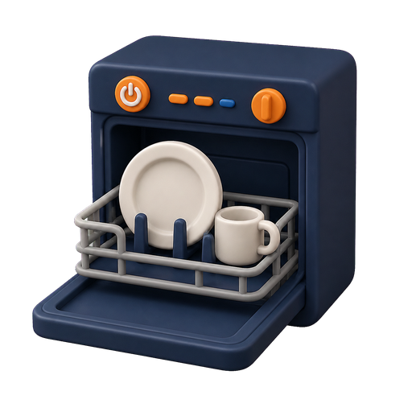

<p align="center">
  
</p>

<h1 align="center">Chore Race</h1>

<p align="center">
  A local-first Home Assistant household planner that turns everyday chores into a friendly family race.
</p>

<p align="center">
  <strong>English</strong> · <a href="README.de.md">Deutsch</a>
</p>

> [!NOTE]
> Chore Race 1.0 is the first stable public family release. Create a Home
> Assistant backup before every upgrade.

## What it does

Chore Race combines an adult-friendly planner with a responsive race card:

- reuse Home Assistant persons, areas, and floors;
- define reusable chore types with points, difficulty, and task artwork;
- plan one-time tasks or recurring schedules;
- organize dependent chores as task chains;
- complete overdue and today's open tasks during normal daily use;
- run a configurable family race with driver, copilot, fair-play, and streak
  scoring;
- undo completions while retaining an audit history;
- manage rewards and view aggregate Home Assistant sensors.

Floor-wide tasks multiply their base race points by the number of Home
Assistant areas assigned to that floor.

<p align="center">
  
  &nbsp;
  
  &nbsp;
  
</p>

## Quick start

1. In HACS, add `https://github.com/StomanAUT/chore-race` as a custom
   **Integration** repository.
2. Install **Chore Race** and restart Home Assistant.
3. Go to **Settings → Devices & services → Add integration** and add
   **Chore Race**.
4. Install the two dashboard card resources as described in
   [Installation and upgrades](docs/installation.md).
5. Add a planner card and a race card to a dashboard:

```yaml
type: custom:chore-race-planner-card
title: Chore Race Planner
max_width: 960
accent_color: "#74829a"
```

```yaml
type: custom:chore-race-card
title: Family Grand Prix
target_points: 12
max_width: 820
accent_color: "#74829a"
```

The integration is configured through the Home Assistant UI. Only one instance
is supported; do not add it to `configuration.yaml`.

## Documentation

- [User guide](docs/user-guide.md)
- [Installation and upgrades](docs/installation.md)
- [Configuration examples](docs/examples.md)
- [Troubleshooting](docs/troubleshooting.md)
- [Architecture](docs/architecture.md)
- [Planner API](docs/planner-api.md)

German documentation:
[Bedienungsanleitung](docs/bedienungsanleitung.md) ·
[Deutsche Projektübersicht](README.de.md)

## Core rules

- Any active participant can complete any permitted open task. A preferred
  participant is a suggestion, not an assignment.
- Outside a race, every completion awards the configured normal score.
- Tasks keep a snapshot of their race points when created.
- A concrete task can have only one active completion.
- Undo reopens the task and keeps the reverted completion in the audit history.
- Team progress counts completed tasks, not points.
- Copilot and fair-play bonuses cannot be combined for the same completion.
- Completed tasks and tasks with active completion history are protected from
  editing and deletion. Reverted standalone tasks can be changed again.

## Automations

The integration provides Home Assistant actions for participants, chore types,
tasks, recurrence rules, races, and completions. `chore_race.ensure_task` is
intended for automations: retries with the same deduplication key return the
existing task instead of creating a duplicate.

See [Configuration examples](docs/examples.md) and
[Planner API](docs/planner-api.md) for supported fields and commands.

## Development

The test suite uses `pytest-homeassistant-custom-component` and a separate
temporary Home Assistant configuration:

```text
pytest
ruff check .
```

Never run the tests against a production Home Assistant configuration.

## License

Chore Race is available under the [MIT License](LICENSE).
